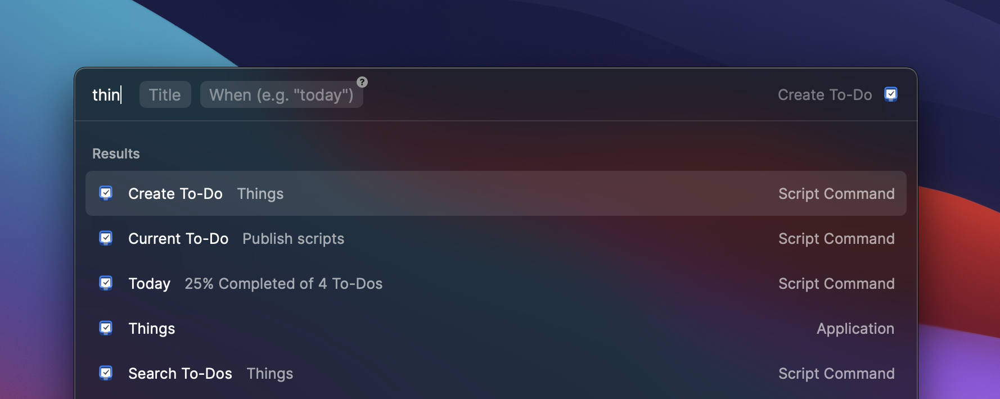
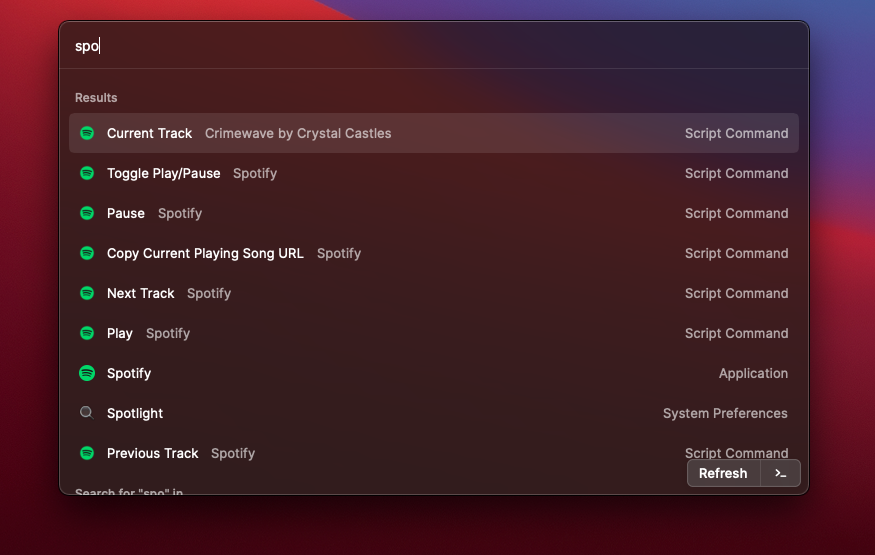

# Raycast Script Commands

[Raycast](https://raycast.com) lets you control your tools with a few keystrokes
and Script Commands makes it possible to execute scripts from anywhere on your desktop.
They are a great way to speed up every-day tasks such as converting data, opening bookmarks
or triggering dev workflows.

## Install Script Commands from this repository

To install new commands, follow these steps:

1. Choose your script from the [community repo](https://github.com/raycast/script-commands/tree/master/commands#apps) and save them into a new directory (alternatively, you can use the [_enabled-commands](https://github.com/raycast/script-commands/tree/master/_enabled-commands) folder for this).
2. Open the Extensions tab in the Raycast preferences
3. Click the plus button
4. Click `Add Script Directory`
5. Select directories containing your Script Commands

**💡 Hint:** We recommend that you don't directly load the community script directories into Raycast to avoid potential restructuring and new script commands suddenly appearing in Raycast.


## Open current directory in VS Code

```
Open Directory
```

## Prettify JSON in clipboard

```
Prettify JSON
```

## Generate image from selected Code

Highlight the code and use:

```
Create Image from code
```

## World Time

Show time in NYC, London and Brisbane

## Speed Test

Show your current internet speed

```
Speedtest
```

## Open Current Directory in iTerm

```
Open Current Finder Directory in iTerm
```

## caniuse

Open caniuse website with provided search text

<div>
  
  <h2>Things</h2>
</div>

Stay on top of your to-dos with this collection of scripts that control the [Things macOS application](https://culturedcode.com/things/) via [Raycast](http://raycast.com). 



### Available scripts

- **Create To-Do:** Create a new To-Do and set an optional deadline.
- **Current To-Do:** Show your current To-Do in Raycast.
- **Search To-Dos:** Search To-Dos with a query.
- **Today:** Get an overview of your completed tasks.

> **Pro tip:** Add the *Current To-Do* or the *Today* script to your favorites to have it always visible when opening Raycast.

## Spotify

<div>
  
  <h2>Spotify</h2>
</div>



### Available scripts
- **Current Track** Show track that is currently playing
- **Copy Current Playing Song URL**
- **Next Track**
- **Previous Track**
- **Play**
- **Pause**
- **Toggle Play/Pausee**